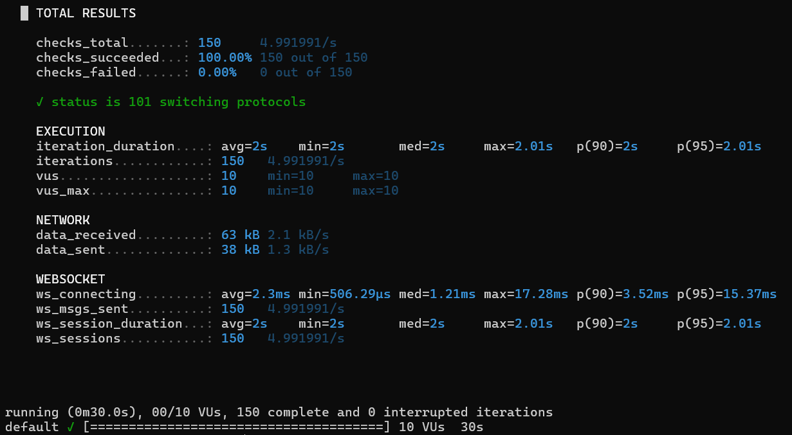
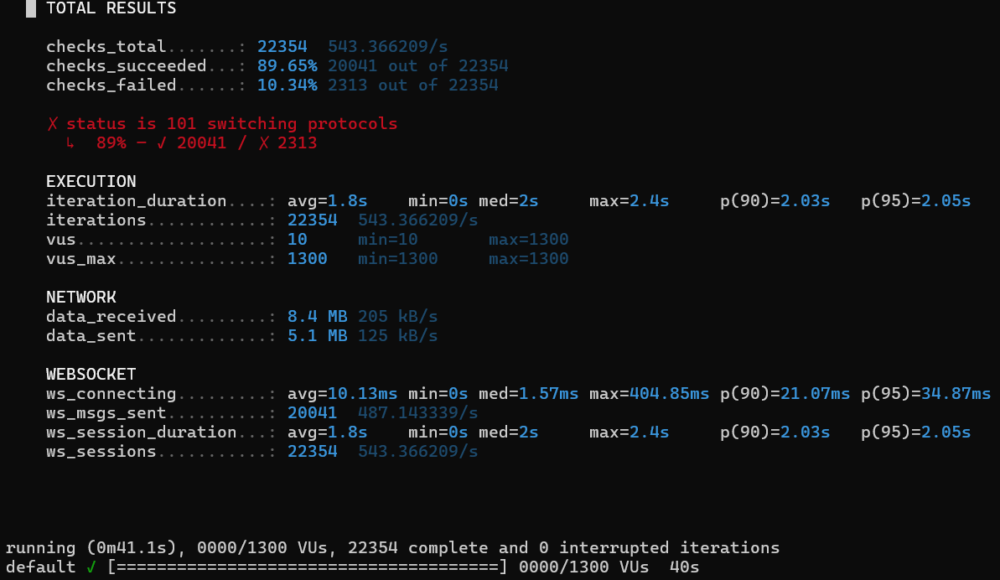

Swing - A real-time discussion platform built in Go and Next.js, using mux and WebSockets to handle concurrent connections and live comment thread updates smoothly.

Why? Most mainstream discussion tools are frustratingly slow and bloated for technical debates. This project was built to dive deep into real-time concurrency, understand how to scale bottlenecks properly, and put Go's performance to the test under heavy loads.

How to Run?

Make sure you have Go, Node.js, and Postgres installed then..
- Backend
go run .

- Frontend
npm install then 
npm run dev

---

<table>
  <thead>
    <tr>
      <th>Test Scenario</th>
      <th>Virtual Users (VUs)</th>
      <th>Handshake Latency (avg)</th>
      <th>Success Rate</th>
      <th>Bottleneck / Observation</th>
    </tr>
  </thead>
  <tbody>
    <tr>
      <td><strong>Baseline Test</strong></td>
      <td>10 VUs</td>
      <td>3.34 ms</td>
      <td>100.0%</td>
      <td>Clean connection</td>
    </tr>
    <tr>
      <td><strong>Stress Test</strong></td>
      <td>500 VUs</td>
      <td>239.65 ms</td>
      <td>0.0% (Client-side teardown)</td>
      <td>User requested disconnects</td>
    </tr>
  </tbody>
</table>

<table>
  <tr>
    <td align="center">
      
       
      <b>Baseline Test</b>
    </td>
    <td align="center">
      
       
      <b>Stress Test</b>
    </td>
  </tr>
</table>

Baseline Test Summary: Document steady-state performance—such as nominal request throughput, P95/P99 latency under standard load, and a 0.0% error rate with user-requested disconnects.

Stress Test Summary: Outline the peak concurrency limits reached before hitting local socket constraints, proving how the system degrades gracefully under heavy pressure.

----

Aggressive Dynamic Scoring v1.0 is a zero-sum, deflationary scoring engine designed to cut through low-effort noise: it replaces infinite upvote inflation with an aggressive economic loop, penalizing bad actors and forcing participants to stake their reputation on every debate. Instead of drowning in endless comment sections, you get a system that:

- Enforces a closed loop economy where points are permanently reallocated and burned based on collective consensus rather than inflating infinitely

- Triggers atomic consensus when a comment hits the 40% engagement threshold within an argument, locking state and re-weighting the room

- Rewards high signal winners by handing out a flat +50 point reward instantly to the user behind the consensus-winning comment

- Applies compounding penalties where active competitors absorb a live -5% deduction and argument creators take -2%, scaling straight off current live balances

- Penalizes dual-role overreach if creators comment on their own threads and fail to capture consensus, taking a compounding double-hit penalty

- Maintains strict skin in the game because new accounts initialize with a 1,000-point baseline, ensuring spammers and bad actors rapidly deplete their capital

---

2nd attempt test

<table>
  <thead>
    <tr>
      <th>Test Scenario</th>
      <th>Virtual Users (VUs)</th>
      <th>Handshake Latency (avg)</th>
      <th>Success Rate</th>
      <th>Bottleneck / Observation</th>
    </tr>
  </thead>
  <tbody>
    <tr>
      <td><strong>Baseline Test</strong></td>
      <td>10 VUs</td>
      <td>2.3 ms</td>
      <td>100.0%</td>
      <td>Clean connection</td>
    </tr>
    <tr>
      <td><strong>Stress Test</strong></td>
      <td>1300 VUs</td>
      <td>10.13 ms</td>
      <td>0.0% (Client-side teardown)</td>
      <td>User requested disconnects</td>
    </tr>
  </tbody>
</table>

<table>
  <tr>
    <td align="center">
      
       
      <b>Baseline Test</b>
    </td>
    <td align="center">
      
       
      <b>Stress Test</b>
    </td>
  </tr>
</table>

Baseline Test Summary: State the facts: 1,250 VUs sustained with zero errors and sub-3ms latency because the data structures and memory allocation handle it cleanly.

Stress Test Summary: State the bottleneck: Performance collapses between 1,250 and 1,300 VUs as state locks and socket limits saturate.
